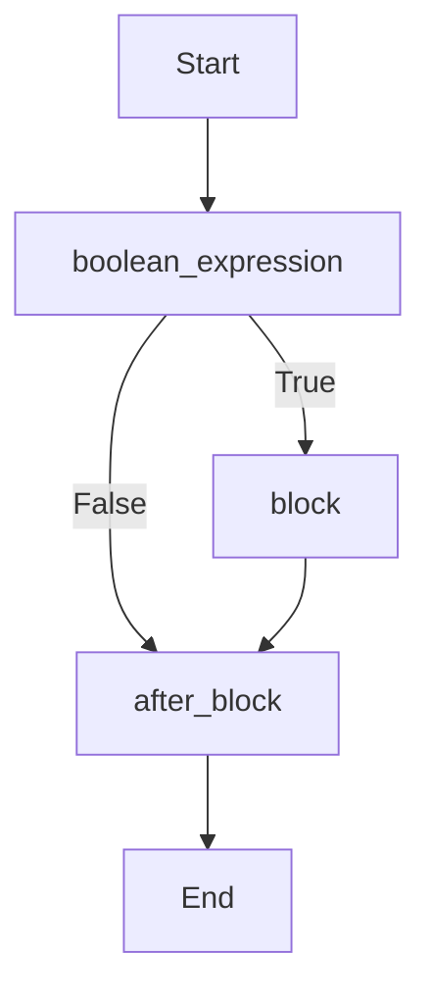
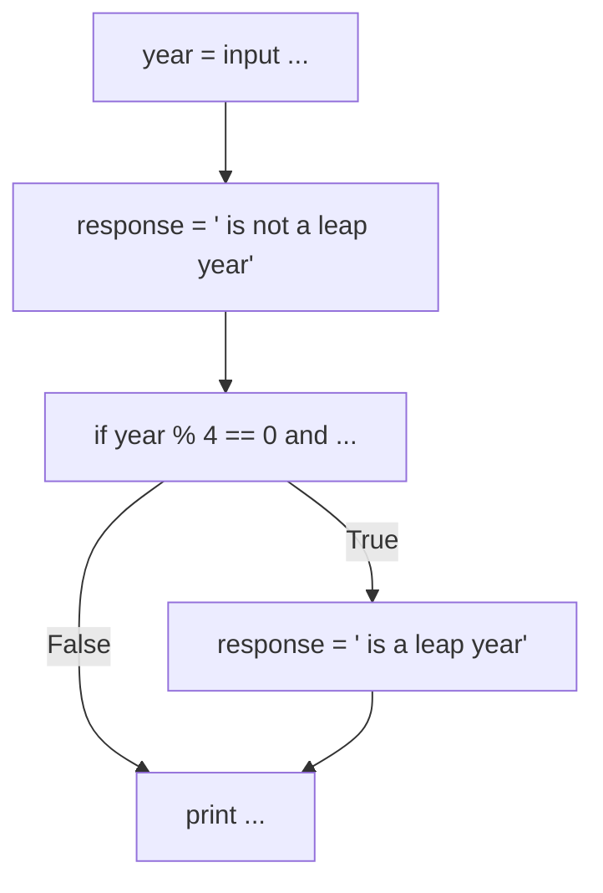
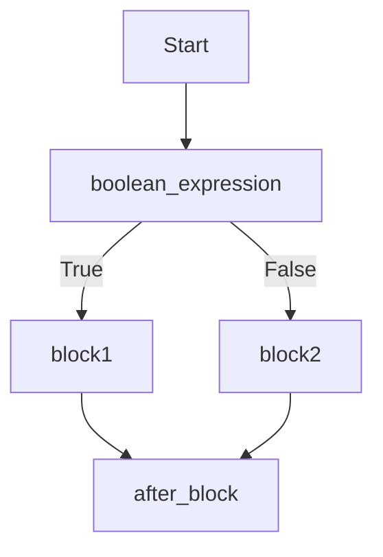
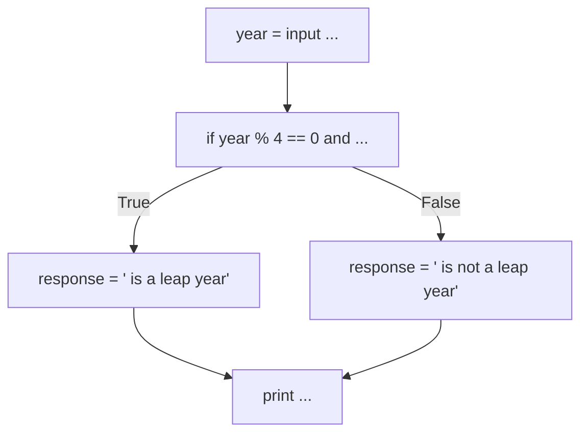

# Python Intro - Week 2 Content
## Strings, lists, boolean, selection, and loops

### 1. Strings

##### Strings in Python
Strings are sequences of characters enclosed by quotes. In Python, there are some operators you can directly use with strings (which might not be available in other languages).

**Example of strings and string operations**: 
*Notice that in Python, both '' and "" can be used to denote a strings, although this is not the case for a lot of other programming languages where there's a difference between a character and a string and '' is reserved for characters and "" for strings.*
```
this_is_a_string = "This is a string in double quotes"
this_is_still_a_string = 'This is a string in single quotes'
character = 'c'

# String additions (or concatenation):
print("hello" + "world")
> "helloworld"

# String multiplication (or repetition):
print(3*"hello")
> "hellohellohello"
```
To get the length of a string, use `len()`:
```
print(len("hello"))
> 5
```
To convert a variable to a string, use `str()`:
```
an_int = 3
a_float = 3.1415

print("This is not an int " + str(an_int))
> "This is not an int 3"

print("This is not a float " + str(a_float))
> "This is not a float 3.1415"
```
##### Strings methods:
`str.capitalize()` : Returns a copy of the string with its first character capitalized and the rest lowercased.
`str.replace(old,new[,count])`: Returns a copy of the string with all occurences of substring `old` replaced by `new`. If the optional argument `count` is given, only the first `count` number of occurences are replaced.
```
text = ‘a piece of string’
print(len(text))
> 17

print(text.upper())
> ‘A PIECE OF STRING’

print(text)
> ‘a piece of string’

print(text.replace(‘tring’, ‘heet’))
> ‘a piece of sheet’

print(text)
‘a piece of string’

diffText = 3*text.replace(‘a piece of’, ‘not another’)
print(diffText)
> ‘not another stringnot another stringnot another string’

print(diffText.count(‘not’))
> 6
```
#####  Strings slicing:
Say we have a string `s = "HELLO"`, we can use *indexing (more information later)* to access certain parts of `s`:

| `s` | `H` | `E` | `L` | `L` | `O` |
|--|--|--|--|--|--|
|index| 0 | 1 | 2 | 3 | 4 |
|negative index| -5 | -4 | -3 | -2 | -1 |

```
print(s[0])
> 'H'

print(s[4])
> 'O'

# Slicing: Use ':' while indexing. The end is exclusive!
print(s[2:4])
'LL'

# Negative indexing
very_long_string = "This is a very looooooooooong string!"
print(very_long_string[-3:])
> 'ng!'
```
---
### 2. Lists (and arrays)
##### List and indexing:
A `list` is a *data structure*, which is a *container* of multiple objects. Objects inside a `list` can be of any `type`.
| `shopping_list` | `"Milk"` | `"Eggs"` | `"Bread"` |
|--|--|--|--|
|index| 0 | 1 | 2 |
|negative index| -3 | -2 | -1 |
**Example of a `list`**:
```
shopping_list = ["Milk","Eggs","Bread"]
print(shopping_list)
> ["Milk","Eggs","Bread"]

print(shopping_list[1])
> "Eggs"

print(shopping_list[-2:-1])
> "Eggs"

mixed_list = ["a string", 1, 3.14, ["a","different","list]]
```
##### List operations:
In Python, there are the following operations we can use on lists:
- `len(a)`: Length of list `a`
- `a + b`: Concatenate list `a` and `b`
- `n*a`: Concatenate `n` copies of list `a` together
- `a[k] = x` : Replace the item in `a` at position `k` with `x`
- `x in a`: `True` if `x` is an item of `a`
- `x not in a`: `True` if `x` is **not** an item of `a`
##### List methods:
In Python, there are the following built-in list methods:

- `a.append(x)`: Append item `x` to the end of `a`
- `a.count(x)`: Returns the number of times item `x` is in `a`
- `a.index(x)`: Returns the index of the first occurence of `x` in `a`
- `a.insert(k,x)`: Insert item `x` at index `k` in list `a`
- `a.pop()`: Return the last item in list `a` and remove it from the list
- `a.remove(x)`: Removes the first occurrence of `x` in `a`
- `a.reverse()`: Revertse all items in `a`
---
### 3. Booleans and selection (a.k.a. conditionals)
##### Boolean data type:
A `boolean`, often referred to as `bool`, is either `True` or `False`. Used to represent the logical evaluation of an *expression*.  
**Example**:
```
print(1 + 1 < 10)
> True
print("my name" == "your name")
> False

a_bool = 3.14 > 5
print(a_bool)
> False
```
##### Boolean operators:
We can combine *expressions* using the following operators:
- `not`
- `and`
- `or`
```
value = 10
print(1 <= value and value <= 100)
> True

print(1 <= value or value <= 9)
> True
```
#####  Comparison operators:
This is used to return a `bool` value for a comparison.
- `<` : Less than.
- `<=`: Less than or equal.
- `>`: Greater than.
- `>=`: Greater than or equal.
- `==`: Equal *(why is it not just `=`?)*.  **Not good for floats!**
- `!=`: Not equal.  **Also not good for floats!**

Can we use these on strings? Yes!
- `<` : Less than.
- `<=`: Less than or equal.
- `>`: Greater than.
- `>=`: Greater than or equal.
- `==`: Equal *(why is it not just `=`?)*. 
- `!=`: Not equal. 
- `x in s`: True if `x` is a *substring* of `s`. *(What is a substring?)*
- `x not in s`: True if `x` is **not** a *substring* of `s`. 

The characters in both strings are compared one by one. When different characters are found then their [Unicode value](https://www.ssec.wisc.edu/~tomw/java/unicode.html) is compared. The character with lower Unicode value is considered to be smaller.

```
hero = "BATMAN"
print(hero == "batman")
> False

print(hero < "Superman")
> True

print("ATM" in hero)
> True
```

##### Selection:
Logic of an `if` statement:
```
if boolean_expression:
	block
after_block
```

**Example:**
```
year = int(input(“Enter  year: ”))
response = “ is not a leap year”
if year % 4 == 0 and (year % 100 != 0 or year % 400 == 0) :
	response = “ is a leap year”
print(str(year) + response)
```

Logic of an `if-else` statement:
```
if boolean_expression:
	block1
else:
	block2
after_block
```

**Example:**
```
year = int(input(“Enter  year: ”))

if year % 4 == 0 and (year % 100 != 0 or year % 400 == 0) :
	response = str(year) + “ is a leap year”
else:
	response = str(year) + “ is not a leap year”
	
print(response)
```

We can make multiple selection using `if-elif-else` statement:
```
if boolean_expression1:
	block 1
elif boolean_expression2:
	block2
elif boolean_expression3:
	block3
elif boolean_expression4:
	block4
else:
	last_block
```
To make more complicated selections, we can also use **nested** conditionals!
```
if boolean_expression1:
	if boolean_expression2:
		block2
	elif boolean_expression3:
		if boolean_expression4:
			block4
		else:
			block3
	else:
		block1
else:
	last_block
```
---
### 4. Loops
A loop can be used to run a block of code multiple times. This is often helpful when we want to achieve a repetitive task without having to manually write down the same code multiple times as it is inefficient and often non-scalable when the data set grows larger. 
There are 2 types of loops in Python:
- `while` loop: The `while` loop depends on a Boolean expression to determine whether or not to continue the loop procedure.
- `for` loop: The `for` loop goes through each and every single item of a collection in order from first to last.

#####  `for` loops:
A `for` loop can be used for the following purposes:
- **for** each number **in** a sequence of numbers
-  **for** each item **in** a list
- **for** each character **in** a string
- **for** each line **in** a file
- **for** variable_name **in** container_name

A `for` is usually used with a [range()](https://docs.python.org/3/library/stdtypes.html#range) object.
By using `range(stop)`, it essentially does the following:
- Iterates over integers from 0 to `stop-1`, that is, integers in `[0,stop)`
- Begins at 0
- Stops when it gets to stop

By using `range(stop)`, it essentially does the following:
- Starts with the integer `start`
- stops when it gets to `stop`
- If `step` is not given, defaults to `step=1`
```
range(stop)	# A container of numbers from from 0 to stop-1
range(start,stop[,step]) # A container of numbers from from start to stop-1 every step

range(6)
> [0,1,2,3,4,5]

range(2,7)
> [2,3,4,5,6]

range(0,10,2)
> [0,2,4,6,8]
```

Example of `for` loops:
```
list_of_people_names = ["Alice","Bob","Charlie"]
list_of_people_ages = [22,23,19]

# Note: You can use len(list_of_people_ages) as well.
# Because they are both the same length, which is 3.
for i in range(len(list_of_people_names)): # This means range(3). Which is [0,1,2].
	# The for loop will automatically assigns i = 0, i = 1, i = 2, at every step.
	current_name = list_of_people_names[i]
	current_age = list_of_people_ages[i]
	print(current_name,"is",current_age,"years old.")
```
```
>> ###### RUN PROGRAM ######
>> Alice is 22 years old.
>> Bob is 23 years old.
>> Charlie is 19 years old.
>> ###### END PROGRAM ######
```

#####  `while` loops:
Example of `while` loops:
```
counted = 0
count_limit = 10	# Count upto 10 numbers, including 0 so that's 0 to 9.

while counted < count_limit:
	print("I have counted", counted, "numbers.")
	counted = counted + 1 # New counted value equals old counted value plus 1.
print("I have finished counting",count_limit,"numbers.")
```
^ **Note**: There is a TAB indentation here to signify the code block that is INSIDE the loop and not OUTSIDE.
```
>> ###### RUN PROGRAM ######
>> I have counted 0 numbers.
>> I have counted 1 numbers.
>> I have counted 2 numbers.
>> I have counted 3 numbers.
>> I have counted 4 numbers.
>> I have counted 5 numbers.
>> I have counted 6 numbers.
>> I have counted 7 numbers.
>> I have counted 8 numbers.
>> I have counted 9 numbers.
>> I have finished counting 10 numbers.
>> ###### END PROGRAM ######
```
Because `while` will keep executing if the given *boolean expression* is `True`, we can use this to create a semi-infinite running program, which will only stops if the user types "quit":
```
running = True
while running:
	option = input("Enter your command:")
	if option == "quit":
		running = False # Next step the while loop will no longer run
	else:
		pass # Do nothing
```
